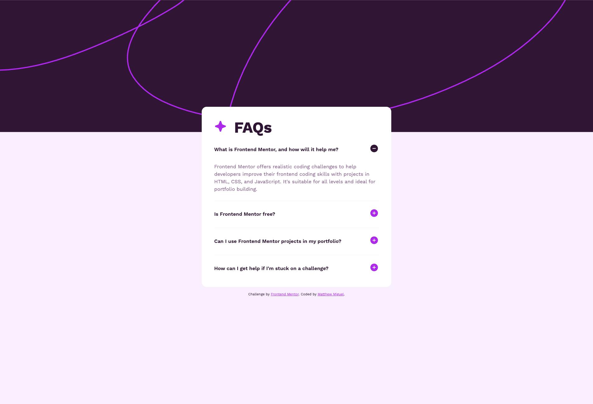

# Frontend Mentor - FAQ accordion solution

This is a solution to the [FAQ accordion challenge on Frontend Mentor](https://www.frontendmentor.io/challenges/faq-accordion-wyfFdeBwBz). Frontend Mentor challenges help you improve your coding skills by building realistic projects.

## Table of contents

- [Overview](#overview)
  - [The challenge](#the-challenge)
  - [Screenshot](#screenshot)
  - [Links](#links)
- [My process](#my-process)
  - [Built with](#built-with)
  - [What I learned](#what-i-learned)
  - [Continued development](#continued-development)
  - [Useful resources](#useful-resources)
- [Author](#author)

## Overview

### The challenge

Users should be able to:

- Hide/Show the answer to a question when the question is clicked
- Navigate the questions and hide/show answers using keyboard navigation alone
- View the optimal layout for the interface depending on their device's screen size
- See hover and focus states for all interactive elements on the page

### Screenshot



### Links

- Solution URL: [Github](https://github.com/MattJM1007/faq-accordian)
- Live Site URL: [Click me](https://mattjm1007.github.io/faq-accordian/)

## My process

### Built with

- Semantic HTML5 markup
- CSS custom properties
- Mobile-first workflow

### What I learned

My main takeaway that I learned here is animating the details/summary using the :details-content pseudo element. The overflow hidden is important here to make the animation smooth, otherwise it would be jumpy due to the content-visibility being a descrete animation.

```css
.faq details::details-content {
  --animation-time: 500ms;

  color: var(--clr-primary-600);
  block-size: 0;
  overflow: hidden;

  /* prettier-ignore */
  transition: 
    block-size var(--animation-time) ease-out, 
    content-visibility var(--animation-time) allow-discrete
  ;
}

.faq details[open]::details-content {
  block-size: auto;
}
```

### Continued development

Always looking to improve CSS architecture and organization. Want to learn more about transitions and animations to elevate my work!

### Useful resources

- [Animate Details and Summary with just CSS](https://youtu.be/Vzj3jSUbMtI?si=Ka7jkC6ff-NOAOnM) - This video by Kevin Powell helped me to learn how to animate the details as a progressive enhancement

## Author

- Frontend Mentor - [@MattJM1007](https://www.frontendmentor.io/profile/MattJM1007)
