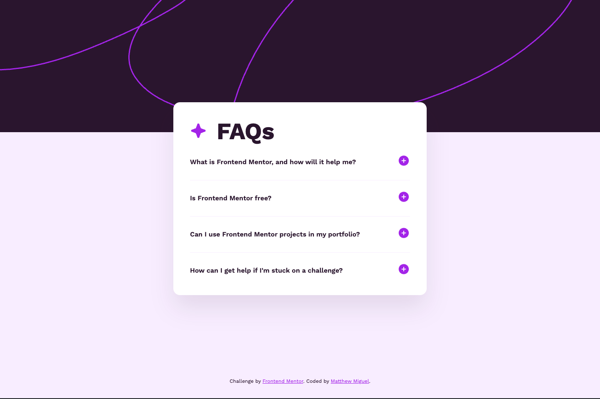

# FAQ Accordion

A CSS-only FAQ accordion built with native HTML elements and animated without any JavaScript.



[Live Demo](https://mattjm1007.github.io/faq-accordian/) · [View Code](https://github.com/MattJM1007/faq-accordian)

---

## Overview

An FAQ component where users can expand and collapse answers. The accordion is built entirely with HTML and CSS — no JavaScript required. Each item opens and closes natively using the `<details>` and `<summary>` elements, with smooth animations handled by CSS.

---

## Features

- Expand and collapse FAQ items
- Smooth open and close animation
- Keyboard accessible out of the box
- No JavaScript

---

## Technical Highlights

**CSS-Only Animation with `interpolate-size`**

Animating the height of `<details>` elements has historically required JavaScript to work around the fact that CSS can't transition to `height: auto`. This project uses the modern CSS `interpolate-size: allow-keywords` property to animate the opening and closing smoothly without any JavaScript.

**Semantic HTML with `<details>` and `<summary>`**

Rather than building a custom accordion with `div`s and JavaScript click handlers, this project uses the native `<details>` and `<summary>` HTML elements. This gives keyboard accessibility and screen reader support without any ARIA attributes or event listeners needed.

---

## Tech Stack

- Semantic HTML (`<details>`, `<summary>`)
- CSS (`interpolate-size`, transitions, custom properties)

---

## Getting Started

```bash
git clone https://github.com/MattJM1007/faq-accordian
```

This is a vanilla HTML/CSS project with no build step. Clone the repo and open `index.html` in your browser.

---

## Challenges & What I Learned

**Animating `<details>` without JavaScript**

The standard approach to animating accordion height requires JavaScript to calculate and set explicit pixel heights. Finding `interpolate-size: allow-keywords` as a CSS-native solution was the key challenge here. It taught me that modern CSS can do a lot without the need for JavaScript.

---

## What I'd Improve

**Browser support fallback**

`interpolate-size` is currently only supported in modern Chromium-based browsers. While the functionality of opening and closing the accordion still works in other browsers, I would add a fallback so the accordion still animates smoothly in Firefox and Safari. This would make the component production-ready across all browsers.
